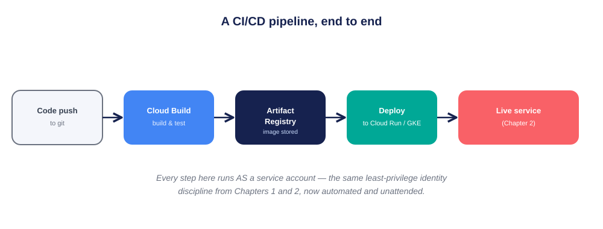
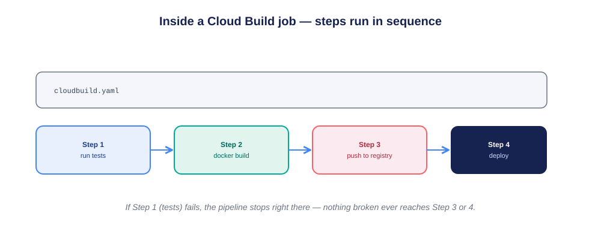
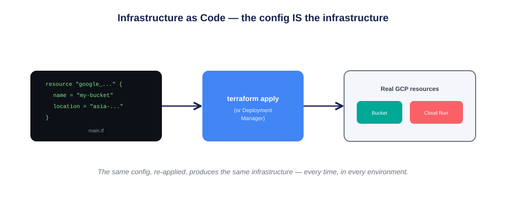
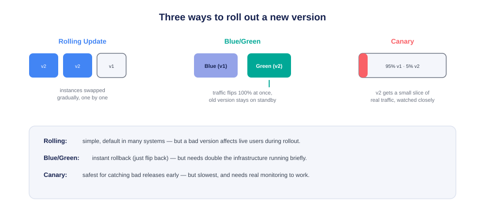
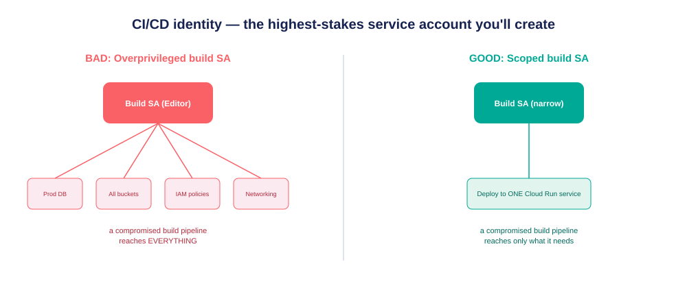
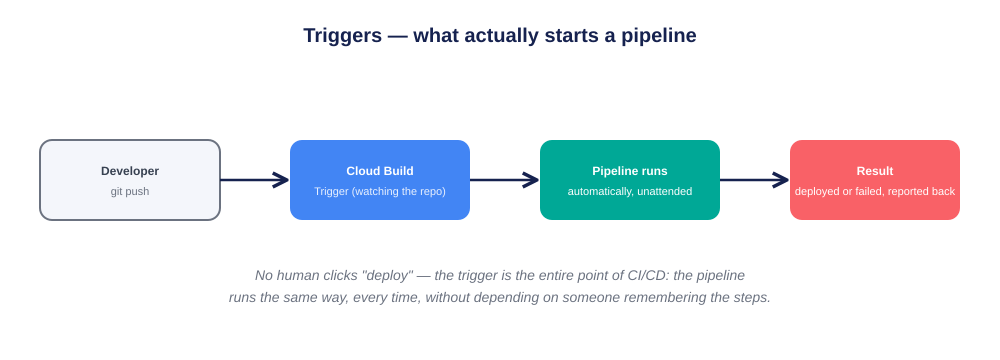

# 🚀 Chapter 6: DevOps & CI/CD — GCP Deep Dive

> *"CI/CD doesn't make deployment faster because it skips steps. It makes deployment safe to do quickly, because a machine repeats the same correct steps every single time."*

[]()
[](https://cloud.google.com/build)
[]()
[]()
[]()

```
CH.1 IAM → CH.2 Compute → CH.3 Storage & DB → CH.4 Networking → CH.5 Data & AI → CH.6 DevOps/CI-CD (you)
```

**This is Chapter 6 of a self-directed GCP learning series.** Every diagram below is built so a complete beginner can follow it. This chapter ties the whole series together: it's the automation that takes code from a developer's laptop and turns it into the exact kind of least-privilege, verified deployment you built by hand in Chapters 1 and 2 — except now it happens automatically, every time, without anyone remembering the steps.

> **Note on this repo:** documented in full theoretical depth, diagram-first. The hands-on project — automating the deployment of the Chapter 2 Cloud Run service — comes next.

---

## 📖 Table of Contents
1. [Why Automate Deployment At All](#-why-automate-deployment-at-all)
2. [The Four Pillars](#-the-four-pillars)
3. [🖼️ Diagram Index](#️-diagram-index)
4. [Cloud Build, Explained Simply](#-cloud-build-explained-simply)
5. [Artifact Registry, Explained Simply](#-artifact-registry-explained-simply)
6. [Infrastructure as Code, Explained Simply](#-infrastructure-as-code-explained-simply)
7. [Deployment Strategies, Compared](#-deployment-strategies-compared)
8. [Why CI/CD Identity Is the Highest-Stakes Service Account](#-why-cicd-identity-is-the-highest-stakes-service-account)
9. [Triggers — What Actually Starts a Pipeline](#-triggers--what-actually-starts-a-pipeline)
10. [Core Principles](#-core-principles)
11. [FAQ](#-faq)
12. [Glossary](#-glossary)
13. [Self-Check Questions](#-self-check-questions)
14. [What's Next](#-whats-next)

---

## 🎯 Why Automate Deployment At All

> **Analogy — a restaurant kitchen's prep checklist.** A good kitchen doesn't rely on a chef remembering, from memory, every single food-safety step for every dish, every single time — under pressure, during a rush, that's exactly when steps get skipped. Instead, the kitchen has a written checklist: wash, prep, cook to temperature, plate. The checklist runs the same way whether it's a slow Tuesday or a packed Saturday night. CI/CD is that checklist, for software.

Every chapter before this one involved you *manually* running commands: `gcloud run deploy`, `gsutil rm`, granting IAM roles by hand. That was the right way to *learn* what each step does. But manually repeating those exact steps correctly, every time, for every change, doesn't scale — and worse, manual steps are exactly where mistakes creep in (like Chapter 2's `invoker-iam-disabled` flag, discovered specifically because a manual assumption didn't match reality). This chapter automates the checklist itself.

---

## 🏛️ The Four Pillars

| Concept | In one sentence | Analogy |
|---|---|---|
| **Cloud Build** | Runs your build/test/deploy steps automatically | The kitchen's prep line |
| **Artifact Registry** | Stores the built, versioned output (container images) | The pantry, organized and labeled |
| **Infrastructure as Code** | Defines your cloud resources as version-controlled text | A recipe card, not a chef's memory |
| **Deployment strategy** | Decides *how* a new version reaches real users | How carefully a new dish is rolled out to the whole menu |

---

## 🖼️ Diagram Index

| # | File | What it shows |
|---|---|---|
| 1 | `diagrams/01-cicd-pipeline.svg` | The full journey: code push → build → registry → deploy → live service |
| 2 | `diagrams/02-cloud-build-steps.svg` | Steps inside one Cloud Build job, running in strict sequence |
| 3 | `diagrams/03-infrastructure-as-code.svg` | How a text config file becomes real, running GCP resources |
| 4 | `diagrams/04-deployment-strategies.svg` | Rolling vs. Blue/Green vs. Canary, shown visually side by side |
| 5 | `diagrams/05-cicd-identity-blast-radius.svg` | Why a build pipeline's service account is the highest-stakes identity in this whole series |
| 6 | `diagrams/06-build-triggers.svg` | What actually starts a pipeline — no human clicking "deploy" |



---

## 🔨 Cloud Build, Explained Simply

**The problem it solves:** turning source code into a running service involves several steps (install dependencies, run tests, build a container image, push it somewhere, deploy it) — doing these by hand, correctly, every time, doesn't scale past one person or one project.

**How it works:** you describe your steps in a `cloudbuild.yaml` file. Cloud Build runs each step **in sequence**, and if any step fails, the pipeline stops immediately — nothing broken moves forward to the next step.



> **Worked example:** if Step 1 (running tests) fails because a developer's change broke something, Cloud Build never reaches Step 2 (building the container) or Step 4 (deploying). The broken code never has a chance to reach production — this is the entire safety value of "stop on first failure."

---

## 📦 Artifact Registry, Explained Simply

**The problem it solves:** a built container image needs somewhere versioned and access-controlled to live, so a deployment step can reliably pull "exactly this version" later — not "whatever the latest build happened to produce."

**How it works:** Artifact Registry stores container images (and other package types) with version tags, and — exactly like Chapter 1's buckets — is governed by IAM. A deployment step needs `artifactregistry.reader` to pull an image; a build step needs `artifactregistry.writer` to push one.

> **Worked example:** a rollback becomes simple and safe because old versions aren't deleted — deploying `v1.4.2` again from Artifact Registry, after a bad `v1.5.0` release, is just pointing the deploy step at an older, still-stored image.

---

## 🏗️ Infrastructure as Code, Explained Simply

**The problem it solves:** clicking through a console to create a bucket, a service, and IAM bindings is easy to do once — and easy to do *inconsistently* the second and third time, especially across dev/staging/production environments.

**How it works:** tools like **Terraform** or GCP's own **Deployment Manager** let you describe your desired infrastructure as text — a bucket, a Cloud Run service, an IAM binding — and then "apply" that description, letting the tool figure out what needs to be created, changed, or left alone.



> **Worked example:** the exact bucket and custom role you built by hand in Chapter 1 could instead be described in a `main.tf` file. Running `terraform apply` in a fresh project would recreate the identical setup — no memory of console clicks required, and the config file itself becomes a reviewable, version-controlled record of what your infrastructure is supposed to look like.

---

## 🚦 Deployment Strategies, Compared

Once a new version is built, *how* does it actually reach real users?



| Strategy | How it works | Strength | Weakness |
|---|---|---|---|
| **Rolling Update** | Instances swapped gradually, one by one | Simple, resource-efficient | A bad version affects some live users during rollout |
| **Blue/Green** | 100% traffic flips at once; old version stays on standby | Instant rollback — just flip back | Needs double the infrastructure running briefly |
| **Canary** | New version gets a small traffic slice, watched closely | Safest — catches bad releases on a small blast radius | Slowest, and needs real monitoring to actually work |

> **Worked example, connecting back to Chapter 2:** if the `iam-lab-runner-service` from Chapter 2 were updated using a Canary strategy, only 5% of requests would hit the new revision at first. If Cloud Monitoring showed a spike in errors, traffic would stay mostly on the old, known-good version — the mistake would affect a small fraction of requests, not everyone.

---

## 🔐 Why CI/CD Identity Is the Highest-Stakes Service Account

Chapter 2's theory made a passing prediction: *"deployment pipelines are themselves workloads that need carefully scoped service accounts — arguably the highest-stakes application of everything in Chapter 1."* This is that idea, in full.



**Why it's higher-stakes than a single VM or bucket:** a CI/CD pipeline's service account often has the *power to change infrastructure itself* — deploy new code, modify IAM bindings, create resources. If that identity is overly broad (like `Editor`), anyone who can get code merged and built — or worse, anyone who compromises the pipeline — inherits all of that power. A single VM's overly-broad service account is one blast radius; a CI/CD pipeline's overly-broad service account can be the blast radius for *everything the pipeline is allowed to touch*.

**The fix is the same lesson as every chapter before this one:** a dedicated, narrowly-scoped build service account — permission to push to one Artifact Registry repo and deploy to one specific Cloud Run service, nothing more — exactly like `iam-lab-reader` and `cloudrun-lab-runner` before it.

---

## ⏱️ Triggers — What Actually Starts a Pipeline



A **trigger** watches a source repository and starts a Cloud Build pipeline automatically when something happens — typically a `git push` to a specific branch. This is the actual point of "continuous" in CI/CD: no one has to remember to run the deployment; the pipeline runs identically whether it's triggered by the newest team member or the most senior engineer.

> **Worked example:** a trigger configured on the `main` branch means every merged change automatically runs tests and deploys — the same checklist, every time, without depending on anyone's memory of the steps (echoing the kitchen analogy from the very start of this chapter).

---

## 📐 Core Principles

1. **Automation replaces memory, not judgment** — the pipeline runs the same correct steps every time; humans still decide what those steps should be.
2. **Fail fast, fail early** — a pipeline that stops at the first broken step (tests) prevents broken code from ever reaching a later, more dangerous step (deploy).
3. **Infrastructure as Code makes environments reproducible** — the same config, applied twice, should produce the same result.
4. **Deployment strategy is a risk decision, not just a technical one** — Canary trades speed for safety; Blue/Green trades infrastructure cost for instant rollback.
5. **The CI/CD identity deserves the most scrutiny of any service account you'll create** — it often has the power to reshape infrastructure itself.
6. **Triggers are what make it "continuous"** — a pipeline a human has to remember to run by hand isn't really CI/CD yet.

---

## ❓ FAQ

**Q: Do I need Infrastructure as Code for a small personal project?**
A: Not strictly — clicking through the console (as done in Chapters 1–3) is a fine way to learn and to build something small. IaC starts paying off once you have multiple environments, a team, or infrastructure changing often enough that manual consistency becomes hard.

**Q: Isn't Canary deployment always the "best" choice?**
A: Not necessarily — it's the safest, but also the slowest and requires genuine monitoring to catch problems in that small traffic slice. A low-stakes internal tool might reasonably use a simple Rolling Update instead.

**Q: Does Cloud Build replace the manual `gcloud` commands from earlier chapters?**
A: It automates *running* those same kinds of commands — the underlying GCP concepts (service accounts, IAM roles, Cloud Run deployment) are identical. CI/CD is about *who/what* runs the commands and *when*, not a different set of concepts.

---

## 📘 Glossary

- **Pipeline** — the full sequence of automated steps from code change to deployed result.
- **CI (Continuous Integration)** — automatically building and testing code changes as they're merged.
- **CD (Continuous Delivery/Deployment)** — automatically deploying changes that pass CI, either to a staging step (Delivery) or all the way to production (Deployment).
- **Artifact** — a built output of a pipeline, most commonly a container image.
- **Rollback** — reverting to a previous, known-good version after a bad deployment.
- **Blast radius** — how much damage is possible if a given identity or component is compromised or misused.
- **Idempotent (apply)** — running the same Infrastructure as Code config twice produces the same end state, not duplicated resources.

---

## 🧠 Self-Check Questions

1. Using the kitchen checklist analogy, explain why CI/CD reduces mistakes rather than just increasing speed.
2. Why does Cloud Build stop immediately when one step fails, instead of continuing to the next step?
3. What's the practical benefit of Artifact Registry keeping old, tagged versions of a container image?
4. Compare Blue/Green and Canary deployment in terms of what each trades away to get its main benefit.
5. Why is a CI/CD pipeline's service account considered higher-stakes than a single VM's service account?
6. What makes a deployment process "continuous" rather than just "automatable"?

---

## 🔭 What's Next

The hands-on project for this chapter: building a real Cloud Build pipeline that automatically tests, builds, and redeploys the Chapter 2 Cloud Run service on every code push — using a dedicated, narrowly-scoped build service account, proven the same way every chapter before it was.

**Chapter 7 — Observability & Logging** comes after that, closing the loop all the way back to the very first Logs Explorer screenshot this entire series started from.

---

*Part of a self-directed GCP learning series — Chapter 1: [gcp-iam-least-privilege-lab](../gcp-iam-least-privilege-lab) · Chapter 2: [gcp-compute-least-privilege-lab](../gcp-compute-least-privilege-lab) · Chapter 3: [gcp-firestore-least-privilege-lab](../gcp-firestore-least-privilege-lab) · Chapter 4: [gcp-networking-deep-dive](../gcp-networking-deep-dive) · Chapter 5: [gcp-data-ai-deep-dive](../gcp-data-ai-deep-dive)*
